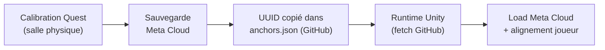
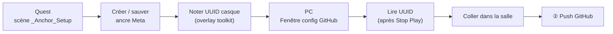

# SpatialAnchors

Configuration centralisée des **ancres spatiales Meta (Quest)** par salle physique.  
Les jeux Unity (ex. *Le Serviteur*) récupèrent les UUID à distance **sans rebuild**.

---

## Sommaire

1. [Principe général](#1-principe-général)
2. [Fichier `anchors.json`](#2-fichier-anchorsjson)
3. [Quelle salle charger ? (`AnchorRoomKey`)](#3-deux-questions-distinctes-ne-pas-confondre)
4. [Cascade UUID — toutes les éventualités](#4-cascade-uuid--toutes-les-éventualités)
5. [Chargement Meta Cloud](#5-chargement-meta-cloud)
6. [Rôles GM vs Client (réseau NGO)](#6-rôles-gm-vs-client-réseau-ngo)
7. [Scénario : GitHub indisponible](#7-scénario--github-indisponible)
8. [Scénario : recalibration d'urgence par le GM](#8-scénario--recalibration-durgence-par-le-gm)
9. [Ajouter une nouvelle salle](#9-ajouter-une-nouvelle-salle)
10. [Fichier local `clientLocalSettings.json`](#10-fichier-local-clientlocalsettingsjson)
11. [Mise à jour après calibration](#11-mise-à-jour-après-calibration)
12. [Dépannage](#12-dépannage)
13. [Référence technique Unity](#13-référence-technique-unity)
14. [Outil Unity « Anchor Setup »](#14-outil-unity-anchor-setup)
15. [Exporter vers un autre projet](#15-exporter-vers-un-autre-projet)

---

## 1. Principe général



| Étape | Qui | Où |
|-------|-----|-----|
| Calibration | Opérateur / GM sur Quest | Salle physique |
| UUID officiel | Mainteneur | Ce repo GitHub |
| Chargement runtime | Chaque casque | Automatique au lancement |

**Règle d'or :** 1 UUID = 1 salle physique. Partagé entre tous les jeux du même lieu.

---

## 2. Fichier `anchors.json`

### URL raw (Unity)

```
https://raw.githubusercontent.com/Genie-Culturel/SpatialAnchors/main/anchors.json
```

> Le loader Unity convertit automatiquement cette URL vers l'**API GitHub Contents** (anti-cache CDN).

### Format actuel

```json
{
  "RoomA": "cfe69293-ac2f-4707-2eb5-1f8f553ea52b",
  "RoomB": "36d5b466-659d-e873-6f57-79ccc0e3eead",
  "RoomDev": "xxxxxxxx-xxxx-xxxx-xxxx-xxxxxxxxxxxx",
  "Room4": "yyyyyyyy-yyyy-yyyy-yyyy-yyyyyyyyyyyy",
  "updatedAt": "2026-07-07T14:38:26+02:00"
}
```

| Champ | Description |
|-------|-------------|
| `RoomA`, `RoomB`, … | UUID de l'ancre **Meta Cloud** pour cette salle |
| `updatedAt` | Horodatage de dernière modification (ISO 8601 recommandé) |

### Clés supportées

| Clé JSON | Alias legacy | Usage |
|----------|--------------|-------|
| `RoomA` | `SalleA` | Salle physique A |
| `RoomB` | `SalleB` | Salle physique B |
| `RoomDev` | — | Salle de développement / test |
| `Room4`, `RoomStudio`, etc. | — | Toute clé `Lettre + alphanumérique` |

> Les nouvelles salles s'ajoutent dans le JSON **sans modifier le code Unity**, tant que le nom respecte le format (`RoomStudio`, `RoomTest1`…).

---

## 3. Deux questions distinctes (ne pas confondre)

Le système répond à **deux questions différentes** :

| Question | Champ concerné | Quand |
|----------|----------------|-------|
| **Quelle salle ?** (nom de la clé JSON) | `AnchorRoomKey` | Avant le fetch GitHub |
| **Quel UUID ?** (identifiant Meta) | `AnchorUuid` + cascade | Si GitHub/Meta échoue |

> ⚠️ **`AnchorRoomKey` invalide ≠ passage immédiat au legacy UUID.**  
> Si la clé est absente ou invalide, le jeu choisit un **nom de salle de secours** (Inspector → `RoomB`), puis **tente quand même GitHub** avec ce nom.

### 3.1 — Quelle salle charger ? (`AnchorRoomKey`)

Étape **A** : choisir le **nom de la clé** dans `anchors.json`.

- Si `AnchorRoomKey` valide dans `clientLocalSettings.json` → utiliser cette clé
- Sinon → fallback Inspector (`fallbackRoomKeyIfJsonMissing`, défaut `RoomB`)
- Puis fetch GitHub avec ce nom de clé

### 3.2 — Exemple `clientLocalSettings.json` (sur le Quest)

```json
{
  "AnchorRoomKey": "RoomDev",
  "AnchorUuid": "ba187afc-456d-56bb-bfe0-5a9e2753da1a"
}
```

| Champ | Rôle |
|-------|------|
| `AnchorRoomKey` | **Nom** de la salle → clé dans `anchors.json` |
| `AnchorUuid` | **UUID** de secours (legacy GM) + cache après bind |

---

## 4. Cascade UUID — toutes les éventualités

| Étape | Source | Quand ça s'active |
|-------|--------|-------------------|
| **① GitHub** | `anchors.json` (ce repo) | Toujours en premier (mode remote config) |
| **② Legacy** | `AnchorUuid` GM / session NGO / PlayerPrefs | GitHub KO ou Meta KO |
| **③ Inspector** | UUID compilé dans le build Unity | GitHub + Legacy KO |

---

## 5. Chargement Meta Cloud

Une fois l'UUID résolu : `LoadUnboundAnchorsAsync` → bind → alignement joueur.

| Symptôme | Cause probable | Solution |
|----------|----------------|----------|
| `Query failed` / `no anchors` | UUID absent de Meta Cloud | Recalibrer + mettre à jour `anchors.json` |
| UUID GitHub OK mais Meta KO | Mauvaise salle physique | Se placer dans la bonne salle |
| OK fetch PC, Meta KO | Normal — Meta non supporté sur PC | Tester sur Quest en salle |

---

## 6. Rôles GM vs Client (réseau NGO)

| Rôle | Mode normal (GitHub OK) | Secours (GitHub KO) |
|------|-------------------------|---------------------|
| **GM** | Fetch GitHub avec son `AnchorRoomKey` | `AnchorUuid` dans `clientLocalSettings` |
| **Client** | Fetch GitHub avec son `AnchorRoomKey` | UUID de la **session NGO** (partagé par le GM) |

---

## 7. Scénario : GitHub indisponible

Le GM peut recalibrer et partager l'UUID via session NGO. Les clients utilisent le legacy NGO.  
Quand GitHub revient → mettre à jour `anchors.json`.

---

## 8. Scénario : recalibration d'urgence par le GM

1. GM recalibre l'ancre en salle (VR_Panel ou outil in-game)
2. Nouvel UUID → `clientLocalSettings` du GM + session NGO
3. Clients rechargent l'ancre (**R** ou reconnexion)
4. Quand GitHub revient → mettre à jour `anchors.json`

---

## 9. Ajouter une nouvelle salle

1. Calibrer sur Quest (salle physique)
2. Ajouter clé + UUID dans `anchors.json` (via fenêtre **Anchor Setup** sur PC ou édition manuelle)
3. Commit + push sur `main`
4. Sur chaque Quest : `AnchorRoomKey` = nouvelle clé (overlay toolkit ou `clientLocalSettings`)
5. Relancer ou touche **R**

**Exemple :**
```json
"RoomStudio": "a1b2c3d4-e5f6-7890-abcd-ef1234567890"
```

---

## 10. Fichier local `clientLocalSettings.json`

Emplacement : `Application.persistentDataPath/clientLocalSettings.json`

| Champ | Utilisé pour |
|-------|--------------|
| `AnchorRoomKey` | Choisir l'entrée GitHub |
| `AnchorUuid` | Legacy GM + cache après bind |

---

## 11. Mise à jour après calibration

### Procédure recommandée (outil Anchor Setup — juillet 2026)



| Étape | Où | Action |
|-------|-----|--------|
| 1 | **Quest** | Play `_Anchor_Setup` (GM) → VR_Panel → créer / charger / **sauver** l'ancre |
| 2 | **Quest** | Overlay **Anchor Setup Toolkit** → vérifier **UUID casque** et **salle active** |
| 3 | **PC** | Stop Play → **Anchor Setup → Fenêtre config GitHub** |
| 4 | **PC** | **① Charger depuis GitHub** (SHA requis pour push) |
| 5 | **PC** | **Lire UUID ancre chargée sur le Quest** → copier-coller dans la bonne salle |
| 6 | **PC** | **② Pousser sur GitHub** |
| 7 | **Quest** | **Recharger config GitHub** dans l'overlay (ou relance) |

> Le bouton **Lire UUID** sur PC lit `clientLocalSettings.json` (souvent après Stop Play).  
> Sur Quest, l'UUID s'affiche en direct dans l'overlay (**UUID casque**).

### Token GitHub (PC)

- Fine-grained PAT : **Contents Read and write** sur ce repo
- SSO org **Genie-Culturel** : autoriser le token
- Stocké en **EditorPrefs** Unity (jamais dans le projet)

### Vérification rapide

- Overlay : `Config GitHub OK` + UUID casque = UUID de la salle dans le JSON
- `Anchor room: RoomX` (debug NGO) = clé active
- `Ancre Meta assignée` sur Quest en salle physique

---

## 12. Dépannage

| Problème | Action |
|----------|--------|
| Bon UUID GitHub, Meta KO | Recalibrer + mettre à jour JSON |
| `RoomB` affiché mais `AnchorRoomKey: RoomDev` | Vérifier orthographe de la clé |
| Lire UUID vide en Play | Normal sur PC — Stop Play puis relire |
| Push 403 | Token + SSO org + droits Contents write |
| Push SHA manquant | **① Charger depuis GitHub** avant push |

---

## 13. Référence technique Unity

Implémentation de référence : projet **LeServiteur**

| Fichier | Rôle |
|---------|------|
| `AnchorRemoteConfigLoader.cs` | Fetch runtime + parsing JSON dynamique |
| `AnchorRemoteConfigRepository.cs` | API GitHub (fetch, push, SHA) |
| `UnityWebRequestUtil.cs` | HTTP sync fiable en Editor |
| `AnchorManager.cs` | Cascade + Meta Cloud |
| `NetworkManagerMH_NGO.cs` | `AnchorRoomKey` / `AnchorUuid` local |
| `AnchorSetupToolkit.cs` | Overlay Quest (UUID, salles JSON, reload) |
| `AnchorSetupEditorWindow.cs` | Fenêtre PC push GitHub |
| `AnchorSetupSceneTools.cs` | Menu ouvrir scène `_Anchor_Setup` |

### Scène dédiée

- `_Anchor_Setup.unity` — calibration / récupération UUID (ne pas confondre avec scènes prod)
- `EnableSceneManagement` = **désactivé** sur NetworkManager NGO (scène outil)

### Menu Unity (LeServiteur)

- **Anchor Setup → Fenêtre config GitHub**
- **Anchor Setup → Ouvrir scène _Anchor_Setup**

---

## 14. Outil Unity « Anchor Setup »

### Overlay Quest (`AnchorSetupToolkit`)

- **Salle active** : liste dynamique des salles du JSON (nombre + noms)
- **UUID casque** : ancre chargée / sauvée sur le casque
- **UUID GitHub** : lecture seule depuis le dernier fetch
- Boutons : recharger config, recharger ancre Meta (**R**), copier UUID → salle, ouvrir GitHub, raccourci fenêtre PC (Editor Play)

> Le placement manuel d'ancre se fait via **VR_Panel** (boutons prod), pas l'overlay.

### Fenêtre PC (`AnchorSetupEditorWindow`)

- Charger / éditer toutes les salles du JSON
- **Lire UUID** depuis le Quest (via `clientLocalSettings` / Play)
- **Push** vers ce repo (`anchors.json`)

---

## 15. Exporter vers un autre projet

Package portable **Export_Anchor_Setup** (Runtime + Editor + scène + patches) :

```
Export_Anchor_Setup/
├── Runtime/     → scripts réseau + toolkit
├── Editor/      → fenêtre GitHub + menus
├── Scenes/      → _Anchor_Setup.unity
├── Patches/     → checklist AnchorManager, NGO, UI_VR_Panel
└── README.md    → procédure d'import
```

Prérequis projet cible : Meta XR SDK, NGO (si scène complète), patches `AnchorManager` documentés dans `Patches/`.

---

## Jeux connectés

| Jeu | Statut |
|-----|--------|
| Le Serviteur (LeServiteur) | Intégré — scène `_Anchor_Setup` + outil Anchor Setup |

---

*Dernière mise à jour de la doc : juillet 2026 — outil Anchor Setup (fenêtre GitHub + overlay Quest)*
