# SpatialAnchors

Configuration centralisée des **ancres spatiales Meta (Quest)** par salle physique.  
Les jeux Unity (ex. *Le Serviteur*) récupèrent les UUID à distance **sans rebuild**.

---

## Sommaire

1. [Principe général](#1-principe-général)
2. [Fichier `anchors.json`](#2-fichier-anchorsjson)
3. [Quelle salle charger ? (`AnchorRoomKey`)](#3-quelle-salle-charger-anchorroomkey)
4. [Cascade UUID — toutes les éventualités](#4-cascade-uuid--toutes-les-éventualités)
5. [Chargement Meta Cloud](#5-chargement-meta-cloud)
6. [Rôles GM vs Client (réseau NGO)](#6-rôles-gm-vs-client-réseau-ngo)
7. [Scénario : GitHub indisponible](#7-scénario--github-indisponible)
8. [Scénario : recalibration d'urgence par le GM](#8-scénario--recalibration-durgence-par-le-gm)
9. [Ajouter une nouvelle salle](#9-ajouter-une-nouvelle-salle)
10. [Fichier local `clientLocalSettings.json`](#10-fichier-local-clientlocalsettingsjson)
11. [Mise à jour après calibration](#11-mise-à-jour-après-calibration)
12. [Dépannage](#12-dépannage)
13. [Référence technique Unity](#13-référence-technique-unity)

---

## 1. Principe général

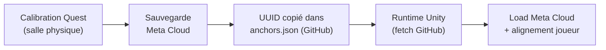

| Étape | Qui | Où |
|-------|-----|-----|
| Calibration | Opérateur / GM sur Quest | Salle physique |
| UUID officiel | Mainteneur | Ce repo GitHub |
| Chargement runtime | Chaque casque | Automatique au lancement |

**Règle d'or :** 1 UUID = 1 salle physique. Partagé entre tous les jeux du même lieu.

---

## 2. Fichier `anchors.json`

### URL raw (Unity)

```
https://raw.githubusercontent.com/Genie-Culturel/SpatialAnchors/main/anchors.json
```

> Le loader Unity convertit automatiquement cette URL vers l'**API GitHub Contents** (anti-cache CDN).

### Format actuel

```json
{
  "RoomA": "cfe69293-ac2f-4707-2eb5-1f8f553ea52b",
  "RoomB": "36d5b466-659d-e873-6f57-79ccc0e3eead",
  "RoomDev": "xxxxxxxx-xxxx-xxxx-xxxx-xxxxxxxxxxxx",
  "updatedAt": "2026-06-16"
}
```

| Champ | Description |
|-------|-------------|
| `RoomA`, `RoomB`, … | UUID de l'ancre **Meta Cloud** pour cette salle |
| `updatedAt` | Date de dernière modification (traçabilité) |

### Clés supportées

| Clé JSON | Alias legacy | Usage |
|----------|--------------|-------|
| `RoomA` | `SalleA` | Salle physique A |
| `RoomB` | `SalleB` | Salle physique B |
| `RoomDev` | — | Salle de développement / test |
| `RoomStudio`, etc. | — | Toute clé `Lettre + alphanumérique` |

> Les nouvelles salles s'ajoutent dans le JSON **sans modifier le code Unity**, tant que le nom respecte le format (`RoomStudio`, `RoomTest1`…).

---

## 3. Quelle salle charger ? (`AnchorRoomKey`)

Chaque casque indique **quelle entrée** lire dans `anchors.json`.

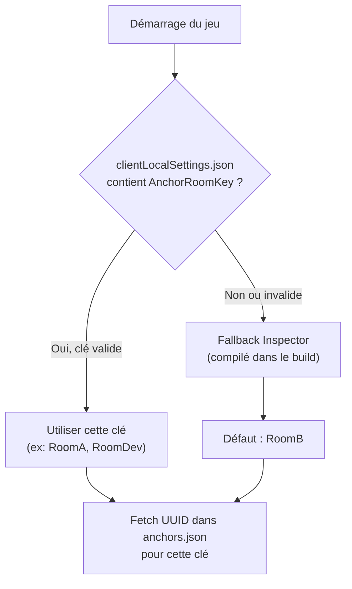

### Exemple `clientLocalSettings.json` (sur le Quest)

```json
{
  "AnchorRoomKey": "RoomA",
  "AnchorUuid": "cfe69293-ac2f-4707-2eb5-1f8f553ea52b"
}
```

| Champ | Rôle |
|-------|------|
| `AnchorRoomKey` | **Quelle salle** → clé dans `anchors.json` |
| `AnchorUuid` | UUID de secours (legacy) — mis à jour après un bind réussi |

---

## 4. Cascade UUID — toutes les éventualités

Ordre **strict** pour obtenir un UUID, avant même d'interroger Meta :

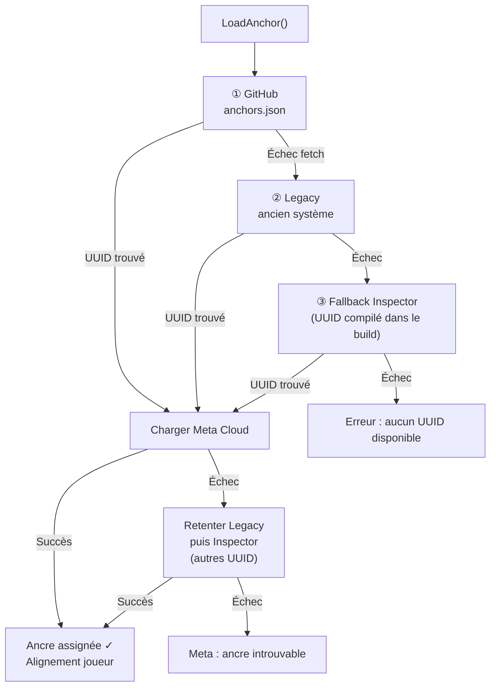

### Tableau récapitulatif

| Étape | Source | Quand ça s'active |
|-------|--------|-------------------|
| **① GitHub** | `anchors.json` (ce repo) | Toujours en premier (mode remote config) |
| **② Legacy** | Voir §6 selon rôle GM/Client | GitHub KO ou Meta KO |
| **③ Inspector** | UUID compilé dans le build Unity | GitHub + Legacy KO |

### Sources Legacy (étape ②)

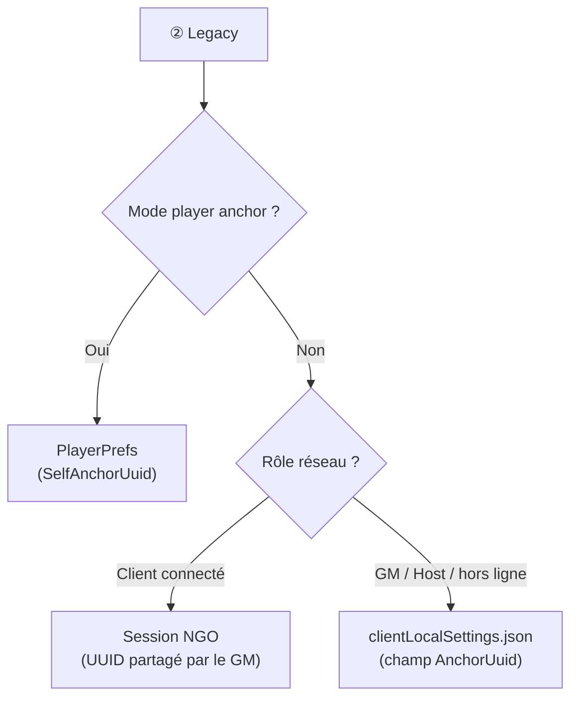

> **Attention :** le legacy lit `AnchorUuid` (un seul UUID), **pas** `AnchorRoomKey`.  
> Si tu changes de salle sans recalibrer, l'UUID legacy peut être obsolète.

---

## 5. Chargement Meta Cloud

Une fois l'UUID résolu (quelle que soit la source) :

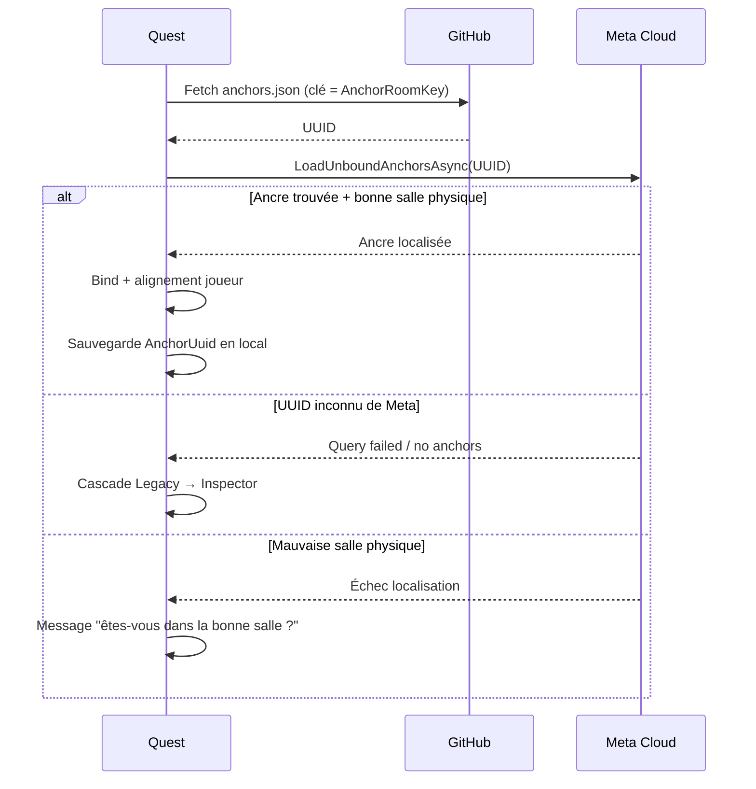

### Cas fréquents d'échec Meta

| Symptôme | Cause probable | Solution |
|----------|----------------|----------|
| `Query failed` / `no anchors` | UUID absent de Meta Cloud | Recalibrer + mettre à jour `anchors.json` |
| UUID GitHub OK mais Meta KO | Mauvaise salle physique | Se placer dans la bonne salle |
| OK en éditeur PC fetch, Meta KO | Normal — Meta non supporté sur PC | Tester sur Quest en salle |

---

## 6. Rôles GM vs Client (réseau NGO)

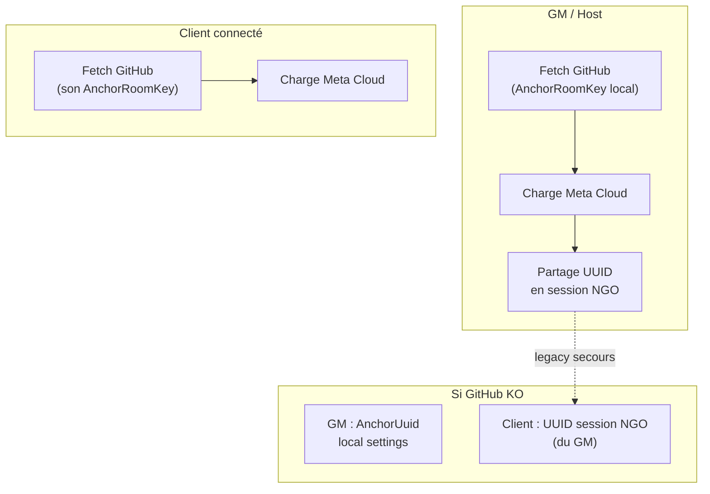

| Rôle | Mode normal (GitHub OK) | Secours (GitHub KO) |
|------|-------------------------|---------------------|
| **GM** | Fetch GitHub avec son `AnchorRoomKey` | `AnchorUuid` dans son `clientLocalSettings` |
| **Client** | Fetch GitHub avec son `AnchorRoomKey` | UUID de la **session NGO** (partagé par le GM) |

> En mode remote config, **chaque casque** tente GitHub indépendamment.  
> La session NGO sert surtout de **filet de sécurité** si GitHub est down.

---

## 7. Scénario : GitHub indisponible

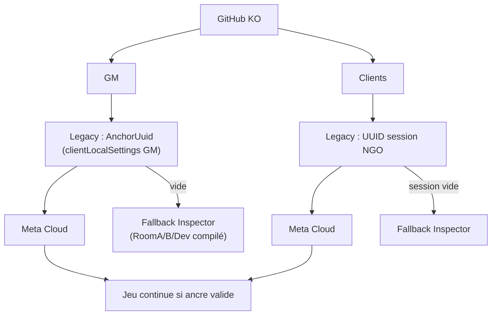

### RoomA / RoomB encore nécessaires ?

| Situation | Besoin de RoomA/B |
|-----------|-------------------|
| GitHub OK (normal) | **Oui** — `AnchorRoomKey` choisit l'entrée JSON |
| GitHub KO + GM a un UUID local valide | **Non** — le GM est la source de vérité |
| GitHub KO + pas d'UUID legacy | **Oui** — fallback Inspector par salle |

---

## 8. Scénario : recalibration d'urgence par le GM

Quand GitHub est down et l'ancre est perdue :

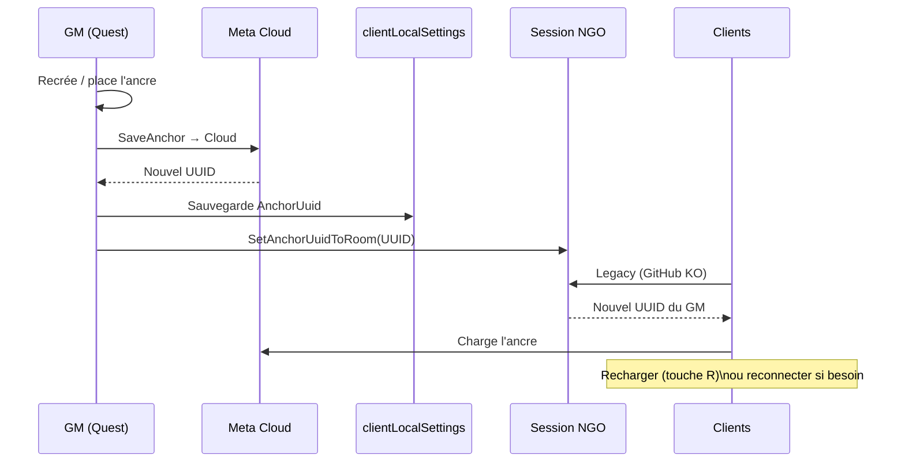

**Étapes opérateur :**

1. GM recalibre l'ancre en salle
2. Nouvel UUID → `clientLocalSettings` du GM + session NGO
3. Clients rechargent l'ancre (**R** ou reconnexion)
4. Quand GitHub revient → mettre à jour `anchors.json` avec le nouvel UUID

---

## 9. Ajouter une nouvelle salle

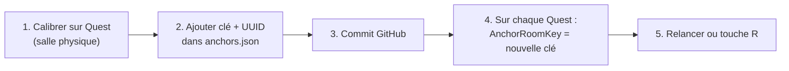

### Exemple : ajouter `RoomStudio`

**GitHub (`anchors.json`) :**
```json
"RoomStudio": "a1b2c3d4-e5f6-7890-abcd-ef1234567890"
```

**Quest (`clientLocalSettings.json`) :**
```json
"AnchorRoomKey": "RoomStudio"
```

> Pas de rebuild nécessaire si le jeu supporte déjà le remote config (LeServiteur oui).

---

## 10. Fichier local `clientLocalSettings.json`

Emplacement sur Quest : `Application.persistentDataPath/clientLocalSettings.json`

| Champ | Utilisé pour | Exemple |
|-------|--------------|---------|
| `AnchorRoomKey` | Choisir l'entrée GitHub | `"RoomA"` |
| `AnchorUuid` | Legacy GM + cache après bind | `"cfe69293-..."` |

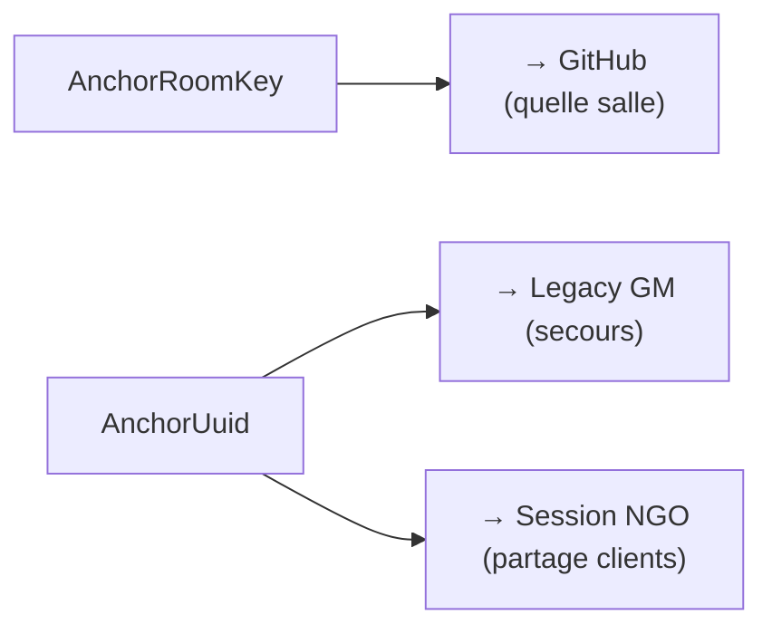

---

## 11. Mise à jour après calibration

### Procédure standard (GitHub disponible)

1. Calibrer l'ancre sur Quest (outil ou GM in-game)
2. Noter l'UUID affiché dans les logs
3. Modifier `anchors.json` — remplacer l'UUID de la salle concernée
4. Mettre à jour `updatedAt`
5. Commit + push sur `main`
6. Sur les Quest : **touche R** ou relance (pas de rebuild)

### Vérification rapide

- Overlay debug : `Source active: GitHub` (vert)
- `UUID utilisé` = celui dans `anchors.json`
- `Ancre Meta assignée : Oui` (sur Quest en salle)

---

## 12. Dépannage

| Problème | Diagnostic | Action |
|----------|------------|--------|
| Bon UUID GitHub, Meta KO | UUID mort ou mauvaise salle | Recalibrer + mettre à jour JSON |
| `Room: RoomB` alors que `AnchorRoomKey: RoomDev` | Clé invalide ou absente | Vérifier orthographe exacte de la clé |
| Client legacy ✗ rouge | Session NGO sans UUID ou différent du GM | GM reconnecte + partage UUID |
| Fetch OK, bind non | Éditeur PC | Normal — tester sur Quest |
| Ancienne UUID après changement salle | `AnchorUuid` local obsolète | Recalibrer ou vider `AnchorUuid` |

### Arbre de décision rapide

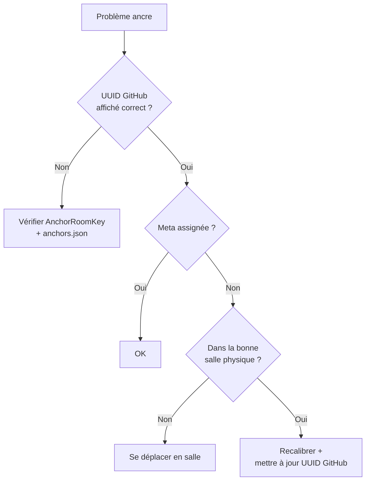

---

## 13. Référence technique Unity

Implémentation de référence : projet **LeServiteur**

| Fichier | Rôle |
|---------|------|
| `AnchorRemoteConfigLoader.cs` | Fetch GitHub + parsing JSON |
| `AnchorManager.cs` | Cascade + Meta Cloud + debug overlay |
| `NetworkManagerMH_NGO.cs` | `AnchorRoomKey` / `AnchorUuid` local |

### Overlay debug (Quest / éditeur)

- Panneau **Anchor Remote Config** : cascade, UUID, source active
- Touche **R** : recharger sans rebuild
- Bouton **Ouvrir config GitHub** : lien vers ce repo

### Anti double-chargement

Si `useRemoteAnchorConfig` est actif, les clients NGO **ne relancent pas** un second `LoadAnchor()` réseau — le chargement auto au démarrage suffit.

---

## Jeux connectés

| Jeu | Statut |
|-----|--------|
| Le Serviteur (LeServiteur) | Intégré |

---

*Dernière mise à jour de la doc : juillet 2026*
